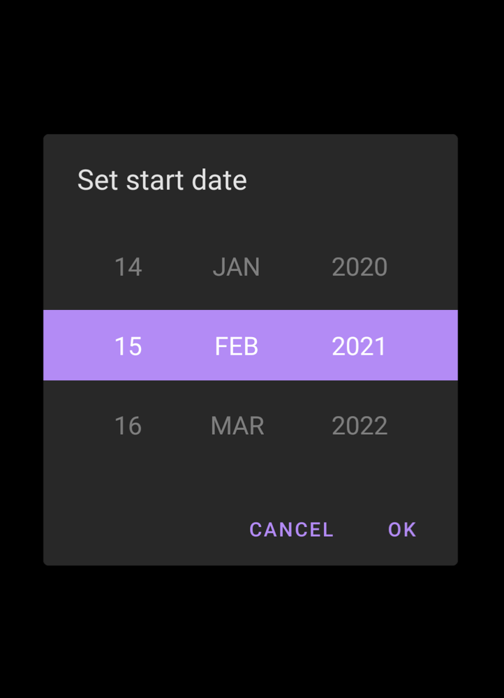

<h1 align="center">Material Date Time Picker</h1></br>

<p align="center">
    <a href="https://opensource.org/licenses/MIT"></a>
    <a href="https://android-arsenal.com/api?level=19s"></a>
    <a href="https://github.com/KotlinBy/awesome-kotlin"></a>
    <a href="https://twitter.com/swnishan"></a>
</p>

<p align="center">A simple, scrollable date and time picker with material UI<p>

## Demo

Demo can be found [here](https://github.com/swnishan/materialdatetimepicker/blob/master/media/demo.md)

### Screenshots

|Dark mode|Light mode|
|---|---|
|||


## Download

Add the following dependedncy in your *root* build.gradle

```groovy
allprojects {
  repositories {
    ...
    maven { url 'https://jitpack.io' }
  }
}
```

Add the following dependency in your app's build.gradle

```groovy
dependencies {
      implementation 'com.github.swnishan:materialdatetimepicker:1:0:0'
}
```


## Usage

### Example in Kotlin

#### Show Material Time picker dialog

```Kotlin
MaterialTimePickerDialog.Builder.setTitle(getString(R.string.set_start_time))
                .setNegativeButtonText(getString(R.string.cancel))
                .setPositiveButtonText(getString(R.string.ok))
                // Below values can be set from the style as well (materialTimePickerViewStyle)
                .setTimeConvention(MaterialTimePickerView.TimeConvention.HOURS_12) // default 12 hours
                .setHour(13) // default current hour
                .setMinute(34) // default current minute
                .setTimePeriod(MaterialTimePickerView.TimePeriod.AM) // default based on the current time
                .setFadeAnimation(350L, 1050L, .3f, .7f)
                .setTheme(R.style.ThemeOverlay_Dialog_TimePicker) // default [R.style.ThemeOverlay_Dialog_MaterialTimePicker]
                .build()
```

#### Show Material Date picker dialog

```Kotlin
MaterialDatePickerDialog.Builder.setTitle(getString(R.string.set_start_date))
                .setNegativeButtonText(getString(R.string.cancel))
                .setPositiveButtonText(getString(R.string.ok))
                // Below values can be set from the style as well (materialDatePickerViewStyle)
                .setDate(OffsetDateTime.now().plusDays(10).toInstant().toEpochMilli()) // default current date
                .setDateFormat(MaterialDatePickerView.DateFormat.DD_MMMM_YYYY) // default DateFormat.DD_MMM_YYYY (05 Feb 2021)
                .setTheme(R.style.ThemeOverlay_Dialog_DatePicker) // default R.style.ThemeOverlay_Dialog_MaterialDatePicker
                .setFadeAnimation(350L, 1050L, .3f, .7f)
                .build()
```

### XML

If you need to add Material Date/Time picker for the layout. All you have to do is:

#### For Material Time picker
```XML
<com.swnishan.materialdatetimepicker.timepicker.MaterialTimePickerView
            style="@style/TimePickerStyle"
            android:layout_width="wrap_content"
            android:layout_height="wrap_content"/>
```

#### For Material Date picker
```XML
<com.swnishan.materialdatetimepicker.datepicker.MaterialDatePickerView
            style="@style/DatePickerStyle"
            android:layout_width="wrap_content"
            android:layout_height="wrap_content"/>
```


### Change default style 

#### For Material Time picker

```XML
 <style name="TimePickerStyle" parent="Widget.MaterialTimePicker">
        <item name="android:textAppearance">@style/TextAppearance.TimePicker</item>
        <item name="android:background">?attr/pickerBackgroundColor</item>
        <item name="highlighterColor">?attr/colorPrimary</item>
        <item name="highlighterHeight">60dp</item>
        <item name="isShowHighlighter">true</item>
        <item name="timeConvention">HOURS_12</item>
        <item name="fadeInAlpha">.3</item>
        <item name="fadeOutAlpha">.7</item>
        <item name="fadeInDuration">300</item>
        <item name="fadeOutDuration">1000</item>
        <item name="defaultHour">10</item>
        <item name="defaultMinute">30</item>
    </style>
```

#### For Material Date picker

```XML
<style name="DatePickerStyle" parent="Widget.MaterialDatePicker">
        <item name="android:textAppearance">@style/TextAppearance.DatePicker</item>
        <item name="android:background">?attr/pickerBackgroundColor</item>
        <item name="highlighterColor">?attr/colorPrimary</item>
        <item name="isShowHighlighter">true</item>
        <item name="highlighterHeight">55dp</item>
        <item name="fadeInAlpha">.3</item>
        <item name="fadeOutAlpha">.7</item>
        <item name="fadeInDuration">300</item>
        <item name="fadeOutDuration">1000</item>
        <item name="minYear">1995</item>
        <item name="maxYear">2050</item>
        <item name="defaultYear">2021</item>
        <item name="defaultMonth">1</item>
        <item name="defaultDay">1</item>
        <item name="dateFormat">DD_MMM_YYYY</item>
    </style>
```


See sample code here: https://github.com/swnishan/materialdatetimepicker/tree/master/sample

## Support custom attibutes

### Common 
|Attribute|Format|Default|
|---|---|---|
|`highlighterColor`|color|primaryColor|
|`highlighterHeight`|dimension|50dp|
|`isShowHighlighter`|boolean|true|
|`fadeInAlpha`|float|.3f|
|`fadeOutAlpha`|float|.7f|
|`fadeInDuration`|integer|3000|
|`fadeOutDuration`|integer|1000|

### Time picker 
|Attribute|Format|Default|
|---|---|---|
|`defaultHour`|integer|current hour|
|`defaultMinute`|integer|current minute|
|`timeConvention`|enum|HOURS_12|

### Date picker 
|Attribute|Format|Default|
|---|---|---|
|`minYear`|integer|current hour|
|`maxYear`|integer|current minute|
|`defaultYear`|integer|current year|
|`defaultMonth`|integer|current month|
|`defaultDay`|integer|current day|
|`dateFormat`|enum|DD_MMM_YYYY|


## Roadmap

Followings are some of the cool features hope to be added

- Tap to edit option (Give a edit option when tab on item)
- Add Bottom sheet (Directly show date/time picker in bottom sheet)

## License

Konfetti is released under the MIT license. See [LICENSE](https://github.com/swnishan/materialdatetimepicker/blob/master/LICENSE) for details.
